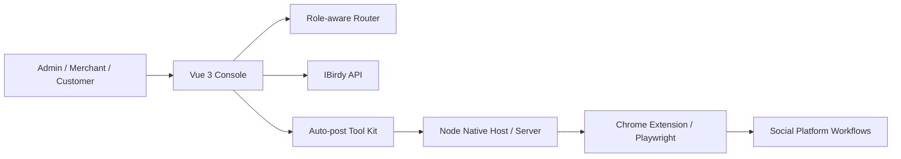

# IBirdy Merchant Operations Console

> Vue-based SaaS operations console and latest IBirdy auto-listing toolkit.  
> A merchant/admin frontend covering orders, products, SaaS operations, billing, value-center workflows, social commerce modules, and an IBirdy auto-post support kit.

## Overview

IBirdy Merchant Operations Console 是一個 Vue 3 / Vite 前端專案，用來展示商家營運後台與 SaaS 管理中心。系統包含登入註冊、商家中心、客戶中心、商品上架、訂單管理、活動系統、金物流、社群訂單、LINE 推播、Instagram / Facebook / Plurk 模組，以及後台管理者的合約、帳務、用量、告警、稽核與加值中心頁面。

最新的 IBirdy 自動上架也整理在這個專案脈絡內：它不是只有畫面，而是包含前端工具入口、Chrome extension、Native host / Node server、Playwright 關留言或自動化流程、客戶使用文件與可下載工具包。

## What I Built

- Vue 3 single-page admin / merchant console
- Role-aware routing for admin, merchant, and customer flows
- Merchant product upload and shop front modules
- Order list, campaign system, customer center, coupon redemption
- Admin SaaS operations pages for billing, usage, alerts, value center, requests, integrations, contracts, accounts, and audit logs
- Social commerce modules for Facebook page, Facebook group, Facebook live, Instagram, LINE, and Plurk
- IBirdy auto-post merchant kit under `public/ibirdy-autopost-merchant-kit`
- Chrome extension package under `public/ibirdy-extension`
- Playwright-based support scripts for browser workflow automation

## Tech Stack

- Frontend: Vue 3, Vite
- State / Utilities: Pinia, VueUse, axios
- UI: Element Plus, Chart.js
- Automation support: Playwright, Node.js
- Browser integration: Chrome extension, native host pattern
- Data import/export: xlsx, QR code, barcode utilities

## Key Modules

- Admin Center
- Admin SaaS Operations
- Admin Billing Center
- Admin Usage Center
- Admin Alert Center
- Admin Value Center
- Merchant Center
- Merchant Subscription Center
- Merchant Value Center
- Merchant Advantage Center
- Product Upload
- Facebook Group / Page / Live workflows
- LINE command, notify, note, and push center
- Instagram order and reply workflows
- Plurk order module

## Architecture

## Portfolio Value

這個專案展示我能做出接近真實 SaaS 後台的操作面：不是單頁 demo，而是包含多角色、多模組、多平台整合、營運稽核、商家訂閱、加值中心與自動化工具入口的完整介面原型。

## Safe Public Notes

公開時建議不要上傳：

- `.env.development.local`
- `node_modules` and `dist`
- `public/ibirdy-autopost-merchant-kit.zip`
- `.exe` release files
- 真實使用者截圖、社群帳號或內部 API URL

可以公開的是 sanitized source、README、架構圖、合成資料截圖與工具設計說明。

