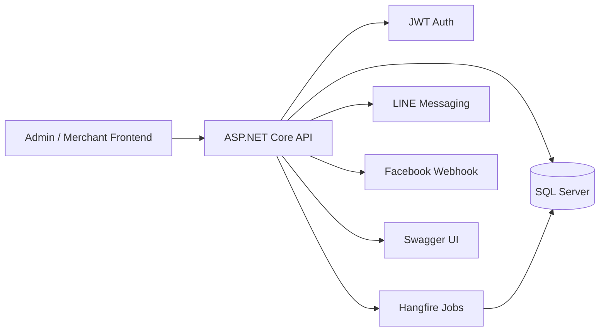

# IBirdy SaaS Commerce Operations API

> Internal prototype turned portfolio case study.  
> A multi-tenant commerce operations backend for orders, products, stock tracking, campaigns, and social messaging workflows.

## Overview

IBirdy SaaS Commerce Operations API 是一個 ASP.NET Core 後端原型，目標是把電商營運中的訂單、商品、庫存、活動、供應商與社群訊息整合到同一個 API 平台。

這個專案適合展示後端系統建模、API 設計、資料庫存取、登入驗證、背景任務、稽核紀錄與第三方訊息服務整合。

## What I Built

- ASP.NET Core 8 REST API backend
- SQL Server persistence
- Entity Framework Core and Dapper data access
- JWT authentication and role-aware API access
- Swagger / OpenAPI API testing surface
- Hangfire background jobs for scheduled checks
- Order, product, stock, supplier, campaign, user, audit log models
- LINE and Facebook webhook-oriented service boundaries
- Tenant-aware data model for SaaS-style merchant separation

## Tech Stack

- Backend: ASP.NET Core 8
- Database: SQL Server
- ORM / Data Access: Entity Framework Core, Dapper
- Auth: JWT Bearer Authentication, BCrypt password hashing
- Background Jobs: Hangfire
- API Docs: Swagger / Swashbuckle
- Integrations: LINE Messaging, Facebook webhook flow

## Architecture

## Portfolio Value

這個專案展示我能把營運需求整理成後端系統：資料模型、API 權限、排程任務、稽核紀錄與外部服務邊界都有被納入，而不是只做 CRUD 頁面。

## Safe Public Notes

公開時建議移除或改寫：

- 真實 SQL Server connection string
- `appsettings.json` 內任何 secret
- 公司或客戶名稱
- 真實 webhook URL
- 測試帳號與內部營運資料

