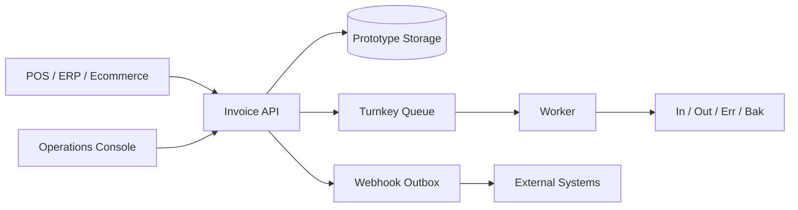

# Electronic Invoice Value-Added Center SaaS Console

> Internal proof of concept turned portfolio case study.  
> A Taiwan electronic invoice value-added center prototype with API-first invoice creation, Turnkey-style queue simulation, tenant isolation, audit logs, webhook delivery, and operational documentation.

## Overview

這個專案是一個電子發票加值中心與 SaaS 營運控制台原型。重點在於把發票平台需要面對的流程拆開：API 建立發票、冪等控制、Turnkey 類型非同步佇列、worker 重試、webhook 通知、租戶隔離、稽核紀錄、監控、備份、資安與送審文件。

## What I Built

- Node.js web application for value-center operations
- REST API endpoints for invoice creation and lookup
- API key based external POS / ERP access
- Idempotency-Key handling to avoid duplicate invoice creation
- Multi-tenant and RBAC-ready control flow
- Turnkey-style queue folders: `In`, `Out`, `Err`, `Bak`
- Worker process with retry and dead-letter handling
- HMAC-SHA256 signed webhook dispatcher
- Docker setup and release checklist
- Operational docs for API, webhook, monitoring, backup, security, migration, and review readiness

## Tech Stack

- Runtime: Node.js
- API: REST / native HTTP ESM modules
- Worker: Node.js background process
- Storage: JSON prototype storage with PostgreSQL migration plan
- Security: API keys, HMAC webhook signatures
- Deployment: Dockerfile, Docker Compose

## Architecture

## Portfolio Value

這個專案展示我能把模糊的商業需求拆成系統規格：API、佇列、重試、webhook、稽核、文件、資安與部署都被當成產品的一部分，而不是事後補洞。

## Safe Public Notes

這不是正式認證的電子發票加值中心產品，公開時應清楚標示為 prototype / proof of concept，並移除任何內部代號、憑證、API key、正式資料與公司識別。

