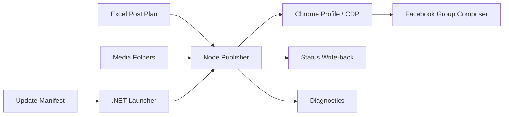

# JJ Auto Listing Publisher

> Desktop automation prototype turned portfolio case study.  
> A branch-store publishing tool that reads Excel post plans, matches media folders, controls Chrome through Playwright/CDP, publishes scheduled Facebook group posts, and writes status back to Excel.

## Overview

JJ Auto Listing Publisher 是一個給分店使用的 Windows 桌面自動化工具。目標是把原本人工複製貼文、上傳圖片、安排發文時間、記錄完成狀態的流程，轉成 Excel 驅動的半自動工具。

此作品集定位為 browser automation / internal operations tooling case study，不建議包裝成正式推薦使用的 Facebook 自動化產品，因為社群平台存在政策與帳號風險。

## What I Built

- Excel-driven queue using `跟團中.xlsx`
- Row-to-folder media matching
- Status column write-back for completed / failed rows
- Completed-row skipping and failed-row retry flow
- Scheduled posting slots and batch limits
- Playwright automation with real Chrome profile or CDP connection
- Facebook composer publishing flow with upload waiting and disabled-button checks
- Manual-action detection for blocked or risky states
- Failure screenshots, HTML captures, debug logs, and optional webhook reports
- .NET one-click launcher
- Installer, updater, repair tool, uninstaller, tutorial, and branch-store usage docs
- Auto-update manifest and release package workflow

## Tech Stack

- Automation: Playwright
- Runtime: Node.js ESM
- Excel: xlsx
- Desktop: .NET WinForms launcher and installer tools
- Browser control: Chrome profile / Chrome DevTools Protocol
- Diagnostics: screenshots, HTML dumps, debug logs

## Architecture

## Portfolio Value

這個專案展示我能把店面現場使用者的流程做成可交付工具：它不只是 script，還包含排程、批次控管、錯誤診斷、桌面啟動器、安裝維修與更新機制。

## Safe Public Notes

公開時不要上傳：

- 真實 Facebook group URL
- 帳號資訊、cookies、Chrome user data
- 真實 Excel 貼文內容與客戶資料
- 失敗截圖或 HTML capture
- `.exe` 大型發行檔

建議只保留 sanitized source、example config、dummy Excel schema、文件和架構說明。

