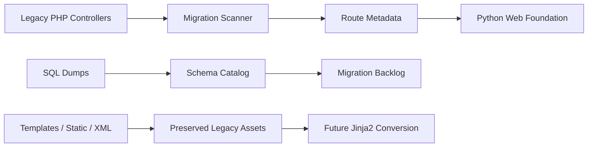

# Legacy PHP Group-Buying System Python Port

> Legacy modernization case study.  
> A first-stage migration of a PHP group-buying/back-office system into a Python web foundation with route mapping, controller inventory, preserved assets, schema cataloging, tests, and deployment notes.

## Overview

這個專案是把舊 PHP 團購 / 門市 / 供應商後台逐步轉成 Python Web 架構的作品集。重點不是把每一行 PHP 硬翻成 Python，而是先盤點系統、建立 migration map、保留資料庫與業務流程，再逐步轉成可維護的 Python 模組。

原本主要學習語言是 C#，這個專案也展示我如何把 C# 的分層思維帶進 Python：Controller / Service / Template 的責任分離、dry-run 設計、部署文件與 E2E 測試。

## What I Built

- Inventory of legacy PHP entry controllers
- Python route metadata and controller catalog
- Runnable Python web app foundation
- Preserved legacy templates, static assets, language files, and text resources
- SQL schema catalog and migration docs
- Third-party integration notes for OAuth, SMS, LINE Notify, LINE Messaging, and payment modules
- Docker packaging and VPS deployment notes
- Playwright E2E test setup
- GitHub release checklist for public portfolio use

## Tech Stack

- Source System: PHP legacy application
- Target: Python web architecture
- Web: Flask / FastAPI path and WSGI foundation
- Templates: Jinja2 migration path
- Database: MySQL-compatible legacy schema path
- Testing: Playwright E2E
- Deployment: Docker, VPS notes

## Architecture

## Portfolio Value

這個專案展示的是 legacy system modernization 能力：先理解系統，再拆成可追蹤的 migration steps。它比單純做新專案更能展示閱讀舊碼、保留業務流程、建立轉換策略與文件化的能力。

## Safe Public Notes

公開時需移除：

- 真實 SQL dump 或客戶資料
- 內部 log、上傳檔、付款設定
- 正式 OAuth / SMS / LINE / payment credentials
- 客戶或公司命名

保留的是轉換方法、架構、synthetic examples、測試方法與學習紀錄。

